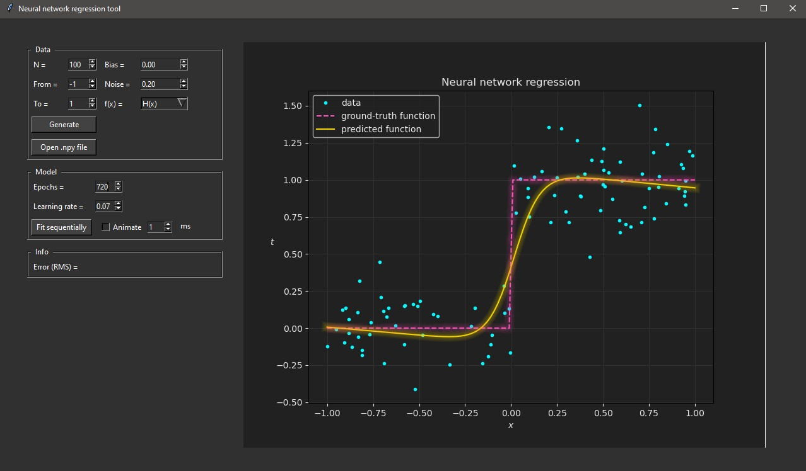
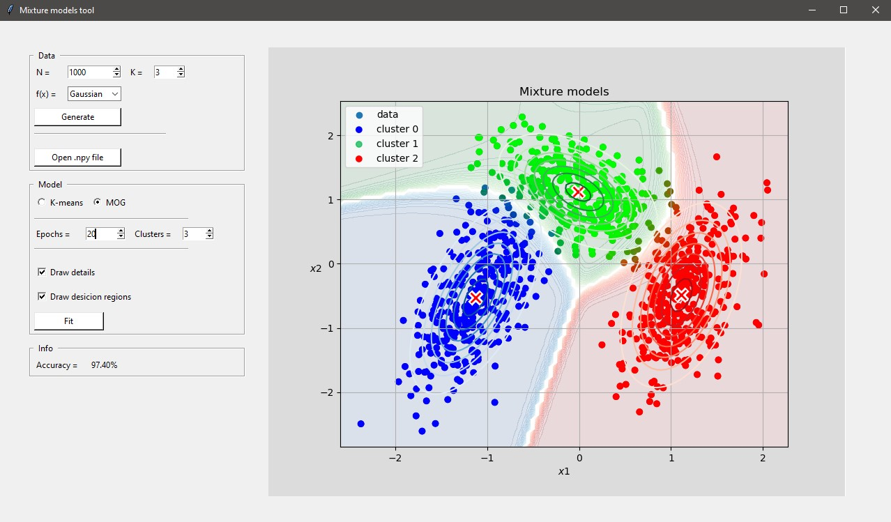

# Bishop-PRML-demos

Python-implemented algorithms from Christopher Bishop's book "Pattern Recognition and Machine Learning". 
Some concepts were also taken from Kevin P. Murphy's "Machine Learning: A Probabilistic Perspective".
These algorithms are grouped by chapters and wrapped around tkinter.

All _main.py_ files mostly contain GUI logic. For exploring ML magic take a look at _model_specific.py_ files.

## Requirements
Python 3.6 with:
- numpy-1.19.5
- matplotlib-3.3.4

## Linear Models for Regression
- Linear regression
- Bayesian linear regression

## Linear Models for Classification
- Linear classification
    - Least-squares
    - Fisher's discriminant
    - The perceptron
- Generative Gaussian
- Logistic regression
- Bayesian logistic regression

## Neural Networks
- Feed-forward neural network

## Mixture Models and EM
- K-means
- Mixture of gaussians

