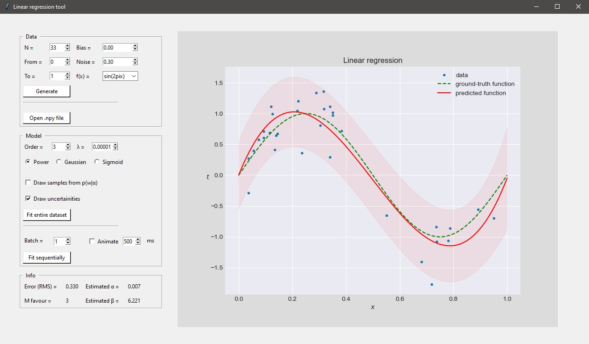
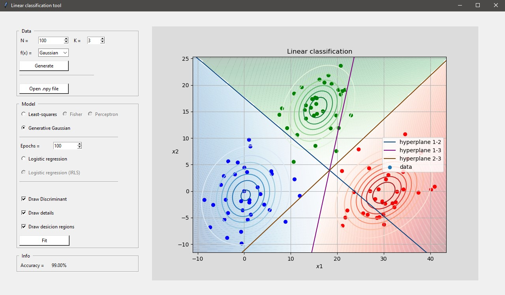

# Bishop-PRML-demos

Python-implemented algorithms from Christopher Bishop's book "Pattern Recognition and Machine Learning". 
Some concepts were also taken from Kevin P. Murphy's "Machine Learning: A Probabilistic Perspective".
These algorithms are grouped by chapters and wrapped around tkinter.

## Linear Models for Regression
- Linear regression
- Bayesian linear regression

## Linear Models for Classification
- Linear classification
    - Least-squares
    - Fisher's discriminant
    - The perceptron
- Generative Gaussian
- Logistic regression
- Bayesian logistic regression

